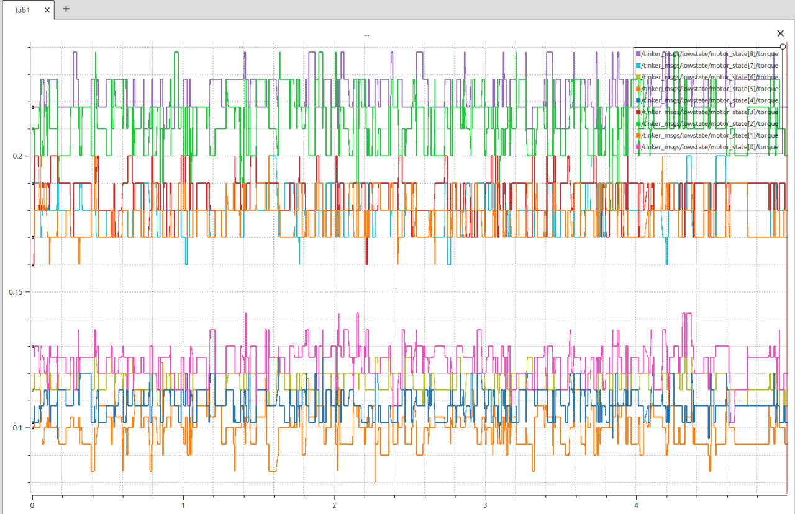

## Laptop node

Данная нода предназначена для отладки кода и проверки работоспособности элементов робота. Она отправляет управляющие сигналы для моторов,
которые включают в себя: положение (position), скорость (velocity), момент (torque), Kd и Kp коэффициенты ПД - регуляторов, а также сигналы вкючения/отключения и сброса в 0.

На ПК, на котором будет работать данная нода, должна стоять та же версия ROS2, что и на одноплатнике. В данной работе используется Ubuntu 24.04, ROS2 Jazzy

## ROS2 Jazzy

### ВАЖНО! На ПК устанавливаейте **desktop** версию

Установите ROS2 Jazzy согласно данной ссылке https://docs.ros.org/en/jazzy/Installation/Ubuntu-Install-Debs.html

Далее склонируйте этот репозиторий

```bash

git clone https://github.com/t0sster/Legged_bot.git

```

Далее можно удалить ненужные директории и собрать проект

```bash

cd Legged_bot // Переход в нужную директорию
rm -rf raspberry-pi-node // Удаление ненужной директории
colcon build // Сборка проекта

```

Теперь необходимо установить зависимости 

```bash

source /opt/ros/jazzy/setup.bash
source /home/user_name/Legged_bot/install/setup.bash
export ROS_DOMAIN_ID=5 // Данный ID должен быть одинаков на пк, и одноплатнике

```
Чтобы каждый раз не прописывать данные команды, можно добавить их в ~/.bashrc

```bash
echo "source /opt/ros/jazzy/setup.bash" >> ~/.bashrc
echo "source /home/user_name/Legged_bot/install/setup.bash" >> ~/.bashrc
echo "export ROS_DOMAIN_ID=5" >> ~/.bashrc
```
## PlotJuggler - визуализация данных

Для визуализации данных очень удобно использовать готовый инструмент с графическим интерфнейсом PlotJuggler

Установите приложение согласно инстуркциям из данного репозитория https://github.com/PlotJuggler/plotjuggler-ros-plugins


## Запуск

Чтобы запустить ноду, впишите команду
```bash

ros2 run test_talker test_talker

```

Для запуска визаулизации, впишите

```bash
ros2 run plotjuggler plotjuggler
```

Если связь все сделано правильно, то в консоль выведется сообщение (цифры могут быть другими)
```
[INFO] [1769078478.035052547] [constant_position_talker]: Started constant position control:
  - Target position: -6.0
  - Target velocity: 0
  - Kp: 15.0, Kd: 0.65
  - Torque FF: 0.0
  - Publishing rate: 50.0 Hz
  - Controlling 10 motors

```
А в plotjuggler можно будет вывести графики различных величин



## Особенности реализации

- **Простая отладочная нода**: Предназначена для быстрой проверки связи между ПК и Raspberry Pi, а также базовой работоспособности моторов.
- **Постоянное управление**: Отправляет команды на все 10 моторов с фиксированными значениями позиции, скорости и коэффициентов регулятора.
- **Два канала управления**:
  - `/tinker_msgs/lowcmd` — основной массив команд (`LowCmd`) с параметрами ПД-регулятора и целевыми значениями.
  - `/tinker_msgs/controlcmd` — отдельные команды включения (`ENABLE = 252`) для каждого мотора (публикуется по одному сообщению на мотор при каждой итерации).
- **Подписка на обратную связь**: Получает и сохраняет последнее состояние системы (`LowState`) для возможного расширения логики (например, замкнутый контур).
- **Логирование**: Выводит информационное сообщение при запуске и отладочные данные (если включён уровень `DEBUG`), включая фактические отправленные значения.
- **Гибкость через параметры**: Все ключевые параметры (позиция, скорость, Kp/Kd и т.д.) заданы как атрибуты класса и их легко изменить для тестирования разных режимов без перекомпиляции.
- **Совместимость с аппаратной нодой**: Формат сообщений полностью соответствует ожидаемому Raspberry Pi-нодой, включая преобразование единиц (радианы ↔ градусы) на стороне STM32.
