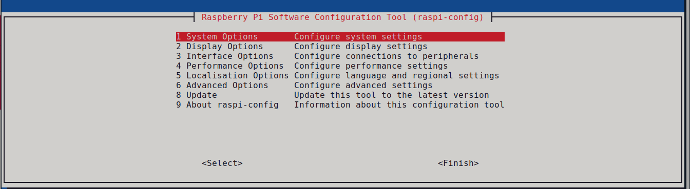

## Raspberry pi node

Данная нода предназначена для получения сигналов управления от ПК, упаковки их в SPI протокол и передаче низкоуровевому контроллеру STM32, а также для передачи ПК состояния всех моторов.

На одноплатнике, на котором будет работать данная нода, должна стоять та же версия ROS2, что и на ПК. В данной работе используется Ubuntu 24.04, ROS2 Jazzy

## ROS2 Jazzy

### ВАЖНО! На Raspberry pi устанавливайте **base** версию

С помощью Raspberry Pi Imager на своём пк установите на плату Ubuntu 24.04

Установите ROS2 Jazzy на Raspberry pi согласно данной ссылке https://docs.ros.org/en/jazzy/Installation/Ubuntu-Install-Debs.html

Далее склонируйте этот репозиторий

```bash
git clone https://github.com/t0sster/Legged_bot.git
```

Далее можно удалить ненужные директории и собрать проект

```bash
cd Legged_bot // Переход в нужную директорию
rm -rf laptop-node // Удаление ненужной директории
colcon build // Сборка проекта
```

Теперь необходимо установить зависимости 

```bash
source /opt/ros/jazzy/setup.bash
source /home/user_name/Legged_bot/install/setup.bash
export ROS_DOMAIN_ID=5 // Данный ID должен быть одинаков на пк, и одноплатнике
```
Чтобы каждый раз не прописывать данные команды, можно добавить их в ~/.bashrc

```bash
echo "source /opt/ros/jazzy/setup.bash" >> ~/.bashrc
echo "source /home/user_name/Legged_bot/install/setup.bash" >> ~/.bashrc
echo "export ROS_DOMAIN_ID=5" >> ~/.bashrc
```

## SPI активация

Для работы с SPI его необходимо активировать, а также открыть доступ пользователю

В консоли raspberry выполните:

```bash
sudo raspi-config
```
Откроется графический интерфейс



В нем выберите 3 Interface options -> SPI -> Enable

Если SPI активирован, то он должен появиться в системе

```bash
ls /dev/spidev* //Должно вывести минимум /dev/spidev0.0 и /dev/spidev0.1
```

Далее нужно добавить права пользователю, для использования SPI

```bash
ls -l /dev/spidev*
```

```
crw-rw---- 1 root spi 153, 1 Jan 22 14:15 /dev/spidev0.0
crw-rw---- 1 root spi 153, 2 Jan 22 14:15 /dev/spidev0.1
```
В данном случае группа называется spi (может отличаться). Чтобы добавить права на использование данной группы, выполните:

```bash
sudo adduser your_username spi
```

## Запуск

```bash 
ros2 run motor_control Motor_control
```
При удачном запуске в консоль будут выводится показатели всех моторов
```
[INFO] [1769002426.054831761] [dual_io_node]: SPI frequency: 999.9 Hz
[INFO] [1769002426.054987926] [dual_io_node]: RPY 1 =-146.321, RPY 2 =-88.873, RPY 3 =-88.873
[INFO] [1769002426.055079906] [dual_io_node]: Motor 0 command: pos=0.000, vel=0.000, trq=0.000
[INFO] [1769002426.055225626] [dual_io_node]: Motor 0 status: pos=0.000, vel=0.000, trq=0.000
[INFO] [1769002426.055380754] [dual_io_node]: Motor 1 status: pos=0.000, vel=0.000, trq=0.000
[INFO] [1769002426.055461604] [dual_io_node]: Motor 2 status: pos=0.000, vel=0.000, trq=0.000
[INFO] [1769002426.055537122] [dual_io_node]: Motor 3 status: pos=0.000, vel=0.000, trq=0.000
[INFO] [1769002426.055607028] [dual_io_node]: Motor 4 status: pos=0.000, vel=0.000, trq=0.000
[INFO] [1769002426.055675361] [dual_io_node]: Motor 5 status: pos=-4.440, vel=0.000, trq=-0.006
[INFO] [1769002426.055748323] [dual_io_node]: Motor 6 status: pos=0.000, vel=0.000, trq=0.000
[INFO] [1769002426.055845099] [dual_io_node]: Motor 7 status: pos=0.000, vel=0.000, trq=0.000
[INFO] [1769002426.055920802] [dual_io_node]: Motor 8 status: pos=0.000, vel=0.000, trq=0.000
[INFO] [1769002426.055995208] [dual_io_node]: Motor 9 status: pos=0.000, vel=0.000, trq=0.000
```

## Особенности реализации

- **Архитектура**: ROS 2 нода на C++ (`rclcpp::Node`) с таймером 1 кГц, обеспечивающим детерминированное взаимодействие с аппаратным контроллером через SPI.
- **Безопасность параметров**: Все входные команды (позиция, скорость, момент, Kp/Kd) проходят валидацию и ограничение в соответствии с заданными лимитами (через ROS-параметры).
- **Поддержка нескольких интерфейсов управления**:
  - `/tinker_msgs/lowcmd` — полный массив команд для всех 10 моторов.
  - `/single_motor_command` — управление отдельным мотором.
  - `/tinker_msgs/controlcmd` — системные команды: `ENABLE`, `DISABLE`, `SET_ZERO_POSITION`, `CLEAR_ERROR`, `IMU_CALIBRATE`.
- **Автоматический сброс флага обнуления позиции**: При получении `SET_ZERO_POSITION` нода блокирует отправку старых значений и автоматически снимает флаг через 1 секунду.
- **Публикация состояния**:
  - `/tinker_msgs/lowstate` — полное состояние системы (моторы + IMU).
  - `/imu_state` — отдельный топик IMU .
  - `sensor_msgs/JointState` для будущей визуализации в RViz.
- **Потокобезопасность**: Используются `std::mutex` для защиты данных при асинхронных подписках и `std::atomic` для простых флагов (`en_motor`, `reset_q` и др.).
- **SPI-протокол**: Кастомный бинарный протокол с контрольной суммой, поддержкой версий (`CAN_LINK_COMM_VER2`), и преобразованием единиц (рад ↔ градусы).
- **Отладка**: Вывод частоты SPI-цикла, текущих команд и состояний моторов каждую секунду.